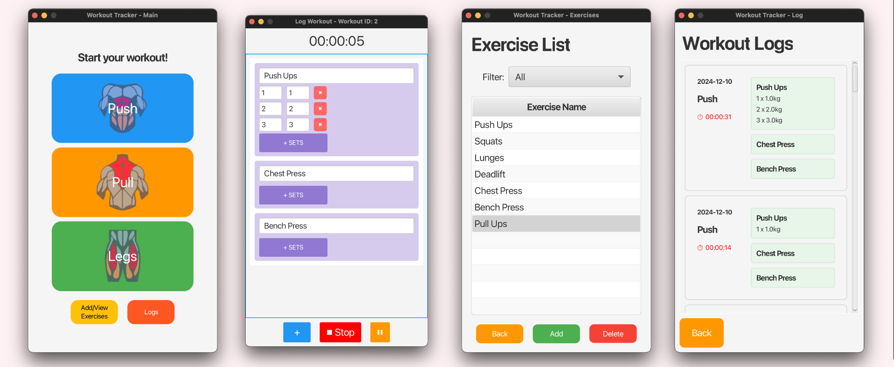

# Workout Tracker

## Preview

## Tech stack
- Language: Java, JavaFX
- Frameworks: Spring Boot (Backend), Hibernate (ORM)
- Database: MySQL
- UI Design: SceneBuilder

## Models
- Development Model: Agile and Increment
- Context Model:
  - Actors: Users (Gym goers)
  - System: Workout App
  - External System: MySQL Database
- Interaction Model:
  - User select a workout plan
  - User create new exercises into a workout plan
  - User starts their workout
  - Timer starts
  - Add/remove sets and exercise
  - Pause - Timer paused - Continue or quit (workout not logged)
  - Stop (workout logged)
  - User view workout logs
